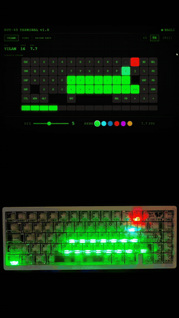

# Weikav NUT65 SignalRGB

Community SignalRGB support for the Weikav NUT65 keyboard.

This repo now has two paths:

- **Legacy / no-flash plugin:** safest path, works on stock firmware, but uses the vendor VIA protocol.
- **QMK SignalRGB firmware:** recommended path, requires flashing firmware, but gives cleaner RGB control, working front lightbar segments, and better brightness behavior.

The short version: the legacy plugin talks to the stock firmware from the outside. The QMK firmware teaches the keyboard a proper SignalRGB Raw HID protocol. One is a polite workaround; the other is giving the keyboard the language book.

<p align="center">
  <a href="https://github.com/bhctsntrk/nut65-pipboy">
    
  </a>
</p>

<p align="center">
  <b>Also check out <a href="https://github.com/bhctsntrk/nut65-pipboy">NUT65 Pip-Boy</a></b>: a Fallout-themed desktop app that runs Snake, Pong, and marquee effects directly on the keyboard LEDs. It does not need SignalRGB.
</p>

## Supported Device

| Property | Value |
| --- | --- |
| Keyboard | Weikav NUT65 / LEKU NUT65 |
| USB VID/PID | `342D:E51A` |
| Bootloader VID/PID | `342D:DFA0` |
| MCU | `WB32FQ95` |
| Bootloader | `wb32-dfu` |
| SignalRGB endpoint | Raw HID, usage page `0xFF60`, usage `0x61` |

This is for the NUT65. Do not flash this firmware onto a different keyboard just because the case looks similar. That is how keyboards become expensive desk ornaments.

## Which Method Should I Use?

| Method | File | Firmware flash | Best for | Tradeoff |
| --- | --- | --- | --- | --- |
| Legacy no-flash | [`Weikav_NUT65.js`](Weikav_NUT65.js) | No | People who do not want flashing risk | More HID spam, partial brightness behavior, lightbar can be flaky |
| QMK SignalRGB | [`Weikav_NUT65_QMK_SignalRGB.js`](Weikav_NUT65_QMK_SignalRGB.js) + [`firmware/leku_nut65_signalrgb_default.bin`](firmware/leku_nut65_signalrgb_default.bin) | Yes | Best SignalRGB support | Requires WB32 DFU driver and firmware flashing |

## Method 1: Legacy No-Flash Plugin

Use this if you are worried about flashing firmware.

1. Download [`Weikav_NUT65.js`](Weikav_NUT65.js).
2. Copy it to:

   ```text
   C:\Users\<YourName>\Documents\WhirlwindFX\Plugins\
   ```

3. Restart SignalRGB.
4. Close VIA and Vial before using SignalRGB.

### Legacy Limitations

- Uses the stock vendor/VIA HID protocol.
- Sends per-key HSV commands and flushes them to the keyboard.
- Can reduce input responsiveness during heavy video effects.
- Brightness behavior is limited because the stock protocol does not expose clean per-key RGB brightness.
- The front lightbar may not fully sync depending on the keyboard's current lightbar mode.

This method is the "no surgery" method. Safe, useful, but not perfect.

## Method 2: QMK SignalRGB Firmware

Use this for the best result.

Files:

- Firmware: [`firmware/leku_nut65_signalrgb_default.bin`](firmware/leku_nut65_signalrgb_default.bin)
- SignalRGB plugin: [`Weikav_NUT65_QMK_SignalRGB.js`](Weikav_NUT65_QMK_SignalRGB.js)
- Source patch: [`patches/nut65-signalrgb-qmk.patch`](patches/nut65-signalrgb-qmk.patch)

What this adds:

- QMK-style SignalRGB Raw HID commands.
- 82 logical LEDs:
  - 67 key/control LEDs.
  - 15 front lightbar segments.
- RGB packets of up to 9 LEDs per HID report.
- Chunk caching, noise filtering, and a stable 10 FPS default profile in the SignalRGB plugin.
- Per-frame write limiting to reduce USB traffic during video and screen-capture effects.
- Better brightness behavior because SignalRGB sends adjusted RGB values directly.

Full flashing guide: [docs/flashing.md](docs/flashing.md)

Recovery notes: [docs/recovery.md](docs/recovery.md)

Technical notes: [docs/technical-notes.md](docs/technical-notes.md)

## QMK Method Installation Summary

1. Make sure you have a second keyboard, or open Windows On-Screen Keyboard before entering DFU mode.
2. Install the WB32 DFU driver if Windows shows `WB Device in DFU Mode` with an error.
3. Put the NUT65 into bootloader mode.
4. Flash:

   ```powershell
   wb32-dfu-updater_cli.exe -t -s 0x08000000 -D firmware\leku_nut65_signalrgb_default.bin
   wb32-dfu-updater_cli.exe -R
   ```

5. Copy [`Weikav_NUT65_QMK_SignalRGB.js`](Weikav_NUT65_QMK_SignalRGB.js) to:

   ```text
   C:\Users\<YourName>\Documents\WhirlwindFX\Plugins\
   ```

6. Restart SignalRGB.

## Build/Test Status

The included QMK firmware was tested on a real NUT65:

- Bootloader entered as `342D:DFA0`.
- Firmware flashed with `wb32-dfu-updater_cli`.
- Keyboard returned as `342D:E51A`.
- Raw HID protocol probe passed:
  - SignalRGB protocol: `1.0.6`
  - LED count: `82`
  - Firmware type: `2` / VIA
  - Enable command responded correctly.

SHA256:

```text
DBED9118ABE7D2C902E014AD28D04D79A103717905C3BAD092196F33F9280725  leku_nut65_signalrgb_default.bin
0C2E81A5394D1666AAEBED9A9D39B043B17B2405ABF94FB11F04D3D865548A9B  leku_nut65_signalrgb_default.hex
47C3A4D5B90B01956D63ADE643194C55A8F6FC71BF6EADD5934B803794D11338  Weikav_NUT65_QMK_SignalRGB.js
EC79FDD73546321D735D782B1C727269127112E94DA16C269142053492A7B543  nut65-signalrgb-qmk.patch
```

## Sources

- OEM QMK fork: <https://github.com/hangshengkeji/qmk_firmware>
- WB32 DFU updater and Windows driver: <https://github.com/WestberryTech/wb32-dfu-updater>
- SignalRGB: <https://signalrgb.com/>

## License

MIT
